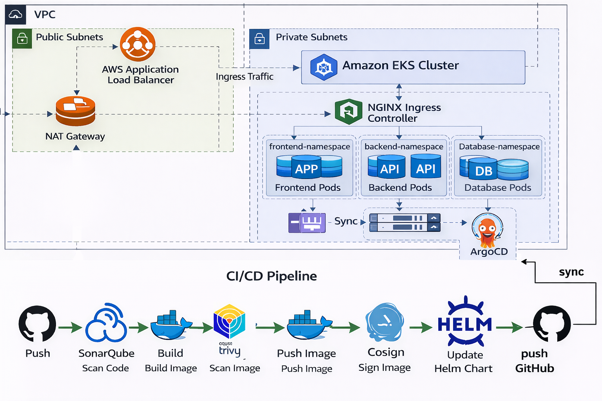
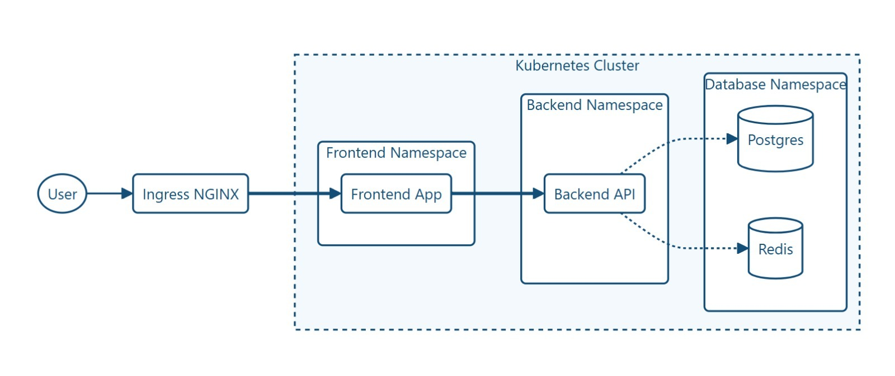

# DevOps Team Manager 🚀

A full-stack **Python-based application** designed and deployed on **Kubernetes**, following real-world **DevOps best practices**.  
The project demonstrates microservices architecture, secure networking, Helm-based deployments, and full observability using **Prometheus and Grafana**.

---

## 🧱 Architecture Overview

- **Frontend**  
  - Python application  
  - Exposed via Kubernetes Service & Ingress

- **Backend**  
  - Python Flask REST API  
  - Handles business logic and API requests

- **Data Layer**  
  - PostgreSQL – persistent data storage  
  - Redis – caching and fast data access

- **Infrastructure**  
  - Kubernetes  
  - Helm (single umbrella release)  
  - Network Policies  
  - Monitoring with Prometheus & Grafana

---

## 📁 Project Structure

```
med-project/
├── Project/                          # Application source code and configurations
│   ├── backend/                      # Python Flask REST API service
│   │   ├── app.py                    # Main Flask application
│   │   ├── Dockerfile                # Container image for backend service
│   │   ├── requirements.txt           # Python dependencies
│   │   ├── test_app.py                # Unit tests
│   │   ├── QUALITY_REPORT.md          # Code quality metrics
│   │   └── SECURITY_REPORT.md         # Security assessment report
│   ├── frontend/                     # Python web frontend application
│   │   ├── index.html                # Web interface
│   │   ├── default.conf               # Nginx configuration
│   │   ├── Dockerfile                # Container image for frontend service
│   │   ├── QUALITY_REPORT.md          # Code quality metrics
│   │   └── SECURITY_REPORT.md         # Security assessment report
│   ├── k8s/                          # Native Kubernetes manifests
│   │   ├── backend/                  # Backend service and configs
│   │   ├── frontend/                 # Frontend service and ingress
│   │   ├── db/                       # Database (PostgreSQL & Redis)
│   │   └── network-policies/         # Network security policies
│   ├── helm/                         # Helm umbrella chart for single release
│   │   └── devops-app/               # DevOps application chart
│   │       ├── Chart.yaml            # Chart metadata
│   │       ├── values.yaml           # Default configuration values
│   │       └── templates/            # Kubernetes resource templates
│   └── Deployment_Instructions.md    # Detailed deployment guide
├── eks-terraform/                    # AWS EKS infrastructure-as-code
│   ├── main.tf                       # Root Terraform configuration
│   ├── variables.tf                  # Input variable definitions
│   ├── outputs.tf                    # Output value definitions
│   ├── provider.tf                   # AWS provider configuration
│   ├── data.tf                       # Data source definitions
│   ├── terraform.tfvars              # Terraform variable values
│   ├── eks/                          # EKS cluster configuration
│   ├── vpc/                          # VPC and networking resources
│   ├── ingress/                      # Ingress controller setup
│   └── README.md                     # EKS deployment documentation
├── ARGOCD_SETUP.md                   # ArgoCD continuous deployment guide
└── README.md                         # This file
```

### 🖼️ System Architecture


### 🖼️ Kubernetes Architecture

---
## ☁️ Deployment Guide (AWS EKS)

For production deployment on AWS EKS, refer to the comprehensive infrastructure-as-code setup in the [eks-terraform/](eks-terraform/) directory. The Terraform configuration automates the provisioning of:

- **EKS Cluster:** Managed Kubernetes cluster with configurable node groups
- **VPC & Networking:** Custom VPC with public/private subnets, NAT gateways, and routing tables
- **Security Groups:** Fine-grained access control for cluster and node communication
- **IAM Roles:** Proper identity and access management for Kubernetes nodes and services
- **Ingress Controller:** Nginx ingress controller for external traffic routing

### Quick Start with Terraform
```bash
cd eks-terraform
terraform init
terraform plan
terraform apply
```

For detailed EKS deployment instructions, see [eks-terraform/README.md](eks-terraform/README.md)

## 🚀 Deployment Guide (Minikube)

### Start Minikube
```bash
minikube start --driver=docker --cni=cilium
```

---

### Enable Ingress Controller
```bash
minikube addons enable ingress
```

---

### Get Minikube IP
```bash
minikube ip
```
Example:  
```
192.168.49.2
```

---

### Update Hosts File
```
192.168.49.2 frontend.nti.com
```

---

### ⚙️ Application Deployment (Helm)
This project uses one Helm umbrella chart with a single release name: `DevOps`.
```bash
helm upgrade --install DevOps ./helm/devops-app \
--namespace devops \
--create-namespace
```

---

### Verify Deployment
```bash
kubectl get pods -n devops
kubectl get svc -n devops
kubectl get ingress -n devops
```

---

### 🌐 Access the Application

#### Minikube (Local Development)
```bash
# Get Minikube IP
minikube ip

# Access frontend via hostname
# http://frontend.nti.com  (after updating hosts file)
```

#### AWS EKS (Production)
```bash
# Get ALB/Ingress Controller Service URL
kubectl get svc -n ingress-nginx
```
**Example:** If your ingress controller service returns `a1234567890.us-east-1.elb.amazonaws.com`, update your frontend ingress host:
```yaml
spec:
  rules:
  - host: a1234567890.us-east-1.elb.amazonaws.com  # ALB URL from ingress controller
    http:
      paths:
      - path: /
        pathType: Prefix
        backend:
          service:
            name: frontend
            port:
              number: 80
```

Then access in browser: `http://a1234567890.us-east-1.elb.amazonaws.com`

---

### 🔒 Network Policies
```bash
kubectl get networkpolicies -A
kubectl describe networkpolicy <policy-name> -n devops
```

---

### 📊 Monitoring (Prometheus & Grafana)

#### Add Helm Repository
```bash
helm repo add prometheus-community https://prometheus-community.github.io/helm-charts
helm repo update
```

#### Install Monitoring Stack
```bash
kubectl create namespace monitoring

helm upgrade --install monitoring \
prometheus-community/kube-prometheus-stack \
-n monitoring
```

#### Verify Monitoring
```bash
kubectl get pods -n monitoring
kubectl get svc -n monitoring
```

#### 📈 Access Grafana (Port Forward)
```bash
kubectl port-forward svc/monitoring-grafana 3000:80 -n monitoring
```
Open: http://localhost:3000

#### Grafana Credentials
- **Username:** `admin`  
- **Password:**
  ```bash
  kubectl get secret monitoring-grafana \
  -n monitoring \
  -o jsonpath="{.data.admin-password}" | base64 -d
  ```

#### 🔍 Prometheus Access (Optional)
```bash
kubectl port-forward svc/monitoring-kube-prometheus-prometheus 9090:9090 -n monitoring
```
Open: http://localhost:9090

---

---

### 🛠 Monitoring & Troubleshooting Commands

#### Cluster Status
```bash
kubectl cluster-info
kubectl get nodes
kubectl get namespaces
```

#### Pod & Resource Monitoring
```bash
kubectl get pods -A
kubectl top nodes
kubectl top pods -A
```

#### Logs & Debugging
```bash
kubectl logs <pod-name> -n devops
kubectl describe pod <pod-name> -n devops
```

#### Helm Management
```bash
helm list -n devops
helm status DevOps -n devops
helm history DevOps -n devops
helm rollback DevOps 1 -n devops
```

---

### ✅ Key DevOps Practices Demonstrated
- Kubernetes multi-tier microservices architecture  
- Secure networking with Network Policies  
- Helm umbrella chart deployment  
- Observability with Prometheus & Grafana  
- Production-style monitoring & troubleshooting  
- Infrastructure-as-code (Terraform) for cloud deployment  
- Clean upgrade and rollback strategy

---

### 📌 Future Enhancements
- Expose `/metrics` endpoint for Python services  
- Custom Grafana dashboards  
- Alerting rules (CPU, memory, pod restarts)  
- CI/CD pipeline integration with ArgoCD
